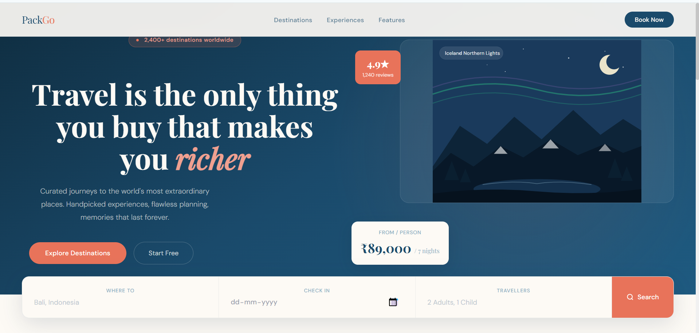
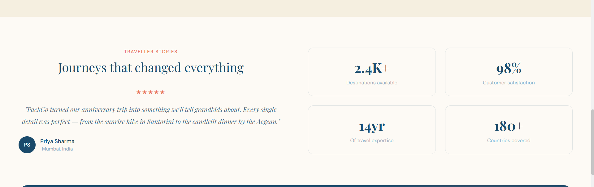
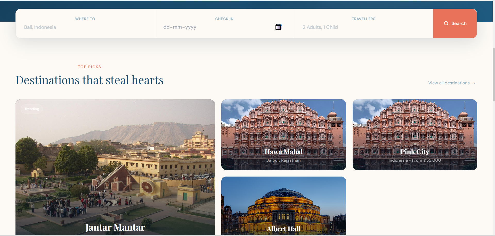

<div style="text-align:center;">

# ✈️ PackGo — Smart Travel Planner

<br/>

[](https://reactjs.org/)
[](https://nodejs.org/)
[](https://www.mongodb.com/cloud/atlas)
[](https://mui.com/)
[](https://github.com/DebasmitaBose0/Travel-Plans-/actions)
[](https://github.com/DebasmitaBose0/Travel-Plans-/actions)

<br>



> **Plan trips. Track expenses. Check weather. Translate languages. Book flights & hotels.**  
> All in one beautiful, full-stack travel companion.

<br>

[🚀 Live Demo](#-live-demo) · [📖 Docs](docs/API_DOCUMENTATION.md) · [🐛 Report Bug](../../issues) · [✨ Request Feature](../../issues)

</div>

---

## 📑 Table of Contents

- [🌍 Overview](#-overview)
- [📸 Screenshots](#-screenshots)
- [✨ Features](#-features)
- [🛠️ Tech Stack](#️-tech-stack)
- [📁 Project Structure](#-project-structure)
- [🚀 Getting Started](#-getting-started)
- [🔑 Environment Variables](#-environment-variables)
- [📡 API Endpoints](#-api-endpoints)
- [🗄️ Database Models](#️-database-models)
- [🔒 Security Features](#-security-features)
- [🎨 Design Highlights](#-design-highlights)
- [🔮 Future Enhancements](#-future-enhancements)
- [🤝 Contributing](#-contributing)
- [🌟 Contributors](#-contributors)
- [📄 License](#-license)
- [👥 Mentors](#-mentors)
- [👤 Author](#-author)
- [🙌 Thanks to Contributors](#-thanks-to-contributors)

---

## 🌍 Overview

**PackGo** is a production-ready, full-stack travel planning application built with the **MERN** stack (MongoDB, Express.js, React 19, Node.js). It consolidates every tool a traveller needs — itinerary management, expense tracking, real-time weather, live language translation, and flight & hotel search — into a single, polished web application.

Whether you're planning a weekend getaway or a month-long adventure, PackGo keeps all your travel data organised, secure, and accessible from any device.

---

## 📸 Screenshots

### 🏠 Landing Page & Dashboard

|                 Landing Page                 |               Dashboard                |
| :------------------------------------------: | :------------------------------------: |
|  |  |

### 🗺️ Trip Detail & Expense Tracker

|            Trip Detail            |            Destinations            |
| :-------------------------------: | :--------------------------------: |
|  |  |

---

## ✨ Features

### 🗺️ Trip Management

- Create, edit, and delete trips with **destination autocomplete**
- Status tracking — `Planned` · `Ongoing` · `Completed`
- Destination images fetched automatically from the seeded catalogue
- Per-trip budget allocation

### 💰 Expense Tracker

- Log expenses by category — `Food` · `Transport` · `Accommodation` · `Activities` · `Shopping`
- Budget utilization **progress bar** with overspend alerts
- Category-wise breakdown with **interactive pie charts** (Recharts)
- **Export expenses to CSV** for offline records

### 🌤️ Weather Forecast

- Real-time weather powered by **OpenWeatherMap API**
- 5-day forecast with weather condition icons
- Smart travel tips based on temperature & conditions

### 🌐 Live Translator

- Instant translation via **Google Translate API** (`google-translate-api-x`) — no API key needed
- **28+ languages** including Hindi, Spanish, French, Japanese, Arabic
- Auto language detection
- Common travel phrases quick-select
- Copy to clipboard with one click

### ✈️ Flight & Hotel Booking

- Search flights by origin, destination, and dates
- Search hotels by location, check-in/check-out, and guests
- Visual flight timeline with airline info and pricing
- Hotel cards with ratings, amenities, and booking CTA
- _(Currently uses mock data — designed for real API integration)_

### 🔐 Authentication & Security

- **JWT-based** authentication with token auto-refresh
- Secure password hashing with **bcryptjs**
- Protected routes with middleware guard
- Profile management and password change
- Security headers via **Helmet** + API rate limiting

### 📊 Dashboard Analytics

- Trip statistics — Total, Completed, Planned, Budget overview
- Total spending analytics across all trips
- **Monthly trip distribution** bar chart (Recharts)
- Quick action cards for navigation
- Upcoming trip cards with status badges

### 🕐 Recently Viewed Destinations

- Tracks the last **5 destinations** you explored on the home page
- Persists across page refreshes using **localStorage**
- Horizontally scrollable cards with destination image, name, and location
- One-click to jump back to a destination
- **Clear all** button to reset history
- No duplicates — revisiting a destination moves it to the top

---

## 🛠️ Tech Stack

### Frontend

| Technology                  | Version | Purpose                                    |
| --------------------------- | ------- | ------------------------------------------ |
| **React**                   | 19      | Component-based UI framework               |
| **Redux + Redux-Thunk**     | 5 / 3   | Global state management with async actions |
| **React Router**            | v7      | Client-side routing with nested layouts    |
| **Material-UI (MUI)**       | v6      | Pre-built UI components and theming        |
| **Recharts**                | 3       | Bar & Pie chart data visualizations        |
| **Axios**                   | 1       | HTTP client with JWT interceptors          |
| **React-Toastify**          | 11      | Toast notification system                  |
| **Leaflet / React-Leaflet** | 1.9 / 5 | Interactive maps                           |

### Backend

## Backend Environment Setup

Create a `.env` file inside the `server` directory before running the backend locally.

Example:

```env
MONGO_URI=mongodb://127.0.0.1:27017/travel-plan
PORT=5000
FRONTEND_URL=http://localhost:3000
```

Make sure MongoDB is running locally before starting the backend server.

On macOS (Homebrew):

```bash
brew services start mongodb-community
```

Then start the backend:

```bash
cd server
npm install
npm run dev
```

Without a valid `MONGO_URI`, authentication-related endpoints such as forgot password may fail due to database connection timeouts.

| Technology                 | Version | Purpose                               |
| -------------------------- | ------- | ------------------------------------- |
| **Node.js**                | 18+     | JavaScript runtime                    |
| **Express.js**             | 4       | REST API server                       |
| **MongoDB + Mongoose**     | Atlas   | NoSQL database with schema validation |
| **jsonwebtoken**           | —       | Token-based authentication            |
| **bcryptjs**               | —       | Password hashing                      |
| **Helmet**                 | —       | Security HTTP headers                 |
| **express-rate-limit**     | —       | API rate limiting (100 req / 15 min)  |
| **google-translate-api-x** | —       | Free Google Translate integration     |
| **cors**                   | —       | Cross-origin resource sharing         |
| **dotenv**                 | —       | Environment variable management       |

---

## 📁 Project Structure

```bash
travel-planner/
├── assets/                          # README screenshots
│   ├── landing_page.png
│   ├── dashboard.png
│   ├── trip_detail.png
│   ├── expense_tracker.png
│   ├── weather_forecast.png
│   └── live_translator.png
│
├── client/                          # ⚛️ React Frontend
│   └── src/
│       ├── components/
│       │   └── PrivateRoute.js      # Auth route guard
│       ├── pages/
│       │   ├── Home.js              # Landing page
│       │   ├── Login.js             # Login with image carousel
│       │   ├── Register.js          # Multi-step registration
│       │   ├── Dashboard.js         # Dashboard layout + sidebar
│       │   ├── NotFound.js          # 404 page
│       │   └── dashboard/
│       │       ├── DashboardHome.js  # Analytics overview
│       │       ├── TripsView.js      # Trip list + create modal
│       │       ├── TripDetail.js     # Trip detail + expenses
│       │       ├── ExpensesView.js   # Expense tracker + pie chart
│       │       ├── BookingView.js    # Flight & hotel search
│       │       ├── WeatherView.js    # Weather forecast
│       │       ├── TranslatorView.js # Live translator
│       │       └── ProfileView.js    # Profile & password
│       ├── redux/
│       │   ├── store.js
│       │   ├── actions/             # Async thunk actions
│       │   ├── reducers/            # State reducers
│       │   └── types/               # Action type constants
│       ├── services/
│       │   └── api.js               # Axios instance + interceptors
│       ├── theme.js                 # MUI custom theme (Poppins)
│       ├── App.js                   # Root component + routes
│       └── index.js                 # Entry point
│
├── server/                          # 🟢 Express Backend
│   ├── controllers/
│   │   ├── authController.js        # Register, login, profile
│   │   ├── tripController.js        # Trip CRUD
│   │   ├── expenseController.js     # Expense CRUD + aggregation
│   │   ├── weatherController.js     # OpenWeatherMap integration
│   │   ├── translatorController.js  # Google Translate integration
│   │   └── bookingController.js     # Flight & hotel (mock)
│   ├── models/
│   │   ├── User.js                  # User schema + password methods
│   │   ├── Trip.js                  # Trip schema with nested objects
│   │   ├── Expense.js               # Expense schema linked to trips
│   │   └── Destination.js           # Destination catalogue schema
│   ├── routes/                      # Express route declarations
│   ├── middleware/
│   │   ├── auth.js                  # JWT verification middleware
│   │   └── errorHandler.js          # Global error handler
│   ├── data/
│   │   ├── seed.js                  # Database seeder
│   │   └── cleanAndSeed.js          # Clean + reseed script
│   └── server.js                    # Express app entry point
│
├── .env.example                     # Environment variable template
├── .gitignore
├── CODE_OF_CONDUCT.md
├── CONTRIBUTING.md
├── LICENSE
└── README.md
```

---

## 🚀 Getting Started

### Prerequisites

Make sure you have the following installed:

- **Node.js** v18 or higher → [Download](https://nodejs.org/)
- **MongoDB** (local) or a free **MongoDB Atlas** cluster → [Get Atlas](https://www.mongodb.com/cloud/atlas)
- **npm** (bundled with Node.js)
- **OpenWeatherMap API Key** (free) → [Get Key](https://openweathermap.org/api)

---

### 1. Clone the Repository

```bash
git clone https://github.com/hitesh-kumar123/Travel-Plans-.git
cd Travel-Plans-
```

### 2. Install Dependencies

> ⚠️ **Important:**  
> This repository uses separate frontend (`client`) and backend (`server`) environments.
>
> Running commands like:
>
> ```bash
> npm run dev
> ```
>
> from the root directory will result in a missing script error.
>
> Please install dependencies and run scripts separately inside the `client` and `server` directories.

````bash

### Important

Run commands from the appropriate project directory.

Backend:

```bash
cd server
npm install
npm run dev
````

Frontend:

```bash
cd client
npm install
npm start
```

Running commands from the wrong directory may result in missing files or package.json errors.

### ⚠️ Important

Do not run installation or start commands from the repository root directory.

Install dependencies separately inside:

- `server/`
- `client/`

Running commands from the root directory may result in missing script errors.

# Install backend dependencies

cd server
npm install

# Install frontend dependencies

cd ../client
npm install

````

### 3. Configure Environment Variables

Copy the example file and fill in your values:

```bash
cp .env.example server/.env
Copy-Item .env.example server\.env
````

Open `server/.env` and update:

```env
PORT=5000
MONGO_URI=mongodb+srv://<username>:<password>@cluster.mongodb.net/travel-planner
JWT_SECRET=your_super_secret_jwt_key_here
WEATHER_API_KEY=your_openweathermap_api_key
```

> **💡 Tip:** The translator uses `google-translate-api-x` — **no API key required!**  
> Get your free weather key at [openweathermap.org/api](https://openweathermap.org/api).

### 4. Seed the Database _(Optional but Recommended)_

```bash
cd server
node data/seed.js
```

This populates the `destinations` collection with sample travel destinations and images for destination autocomplete.

### 5. Run the Application

Open **two separate terminals**:

```bash
# Terminal 1 — Backend (http://localhost:5000)
cd server
npm run dev
```

```bash
# Terminal 2 — Frontend (http://localhost:3000)
cd client
npm start
```

Then open your browser at **[http://localhost:3000](http://localhost:3000)** 🎉

---

## 🔑 Environment Variables

| Variable          | Required | Description                                                        |
| ----------------- | :------: | ------------------------------------------------------------------ |
| `PORT`            |    ✅    | Port for the Express server (default: `5000`)                      |
| `MONGO_URI`       |    ✅    | MongoDB connection string (local or Atlas)                         |
| `JWT_SECRET`      |    ✅    | Secret key for signing JWT tokens (use a long random string)       |
| `WEATHER_API_KEY` |    ✅    | Your free OpenWeatherMap API key                                   |
| `SMTP_HOST`       |    ❌    | SMTP server host for sending emails (ethereal fallback if omitted) |
| `SMTP_PORT`       |    ❌    | SMTP server port (default: `587`)                                  |
| `SMTP_SECURE`     |    ❌    | Use SSL/TLS (`true` or `false`, default: `false`)                  |
| `SMTP_USER`       |    ❌    | SMTP authentication username credential                            |
| `SMTP_PASS`       |    ❌    | SMTP authentication password credential                            |
| `FROM_EMAIL`      |    ❌    | Custom sender email address (default: `noreply@packgo.com`)        |
| `FROM_NAME`       |    ❌    | Custom sender display name (default: `PackGo`)                     |

---

## Troubleshooting

### MongoDB Connection Error

If you see:

```text
The uri parameter to openUri() must be a string, got undefined
```

Make sure your `.env` file exists and contains a valid MongoDB connection string.

### package.json Not Found

If npm reports:

```text
Could not read package.json
```

Verify that you are running commands from the correct project directory (`server/` or `client/`).

## 📡 API Endpoints

Base URL: `http://localhost:5000/api`

### 🔐 Authentication

| Method | Endpoint                     | Description                                      | Auth |
| ------ | ---------------------------- | ------------------------------------------------ | :--: |
| `POST` | `/auth/register`             | Register a new user                              |  ❌  |
| `POST` | `/auth/login`                | Login and receive JWT token                      |  ❌  |
| `GET`  | `/auth/profile`              | Get current user profile                         |  ✅  |
| `PUT`  | `/auth/profile`              | Update user profile                              |  ✅  |
| `PUT`  | `/auth/change-password`      | Change password                                  |  ✅  |
| `POST` | `/auth/request-email-change` | Initiate profile email update                    |  ✅  |
| `POST` | `/auth/verify-email-change`  | Confirm and execute pending profile email change |  ✅  |
| `POST` | `/auth/discard-email-change` | Cancel and discard pending profile email change  |  ✅  |
| `GET`  | `/auth/email-change-status`  | Query active profile email change status details |  ✅  |

### 🗺️ Trips

| Method   | Endpoint     | Description                          | Auth |
| -------- | ------------ | ------------------------------------ | :--: |
| `POST`   | `/trips`     | Create a new trip                    |  ✅  |
| `GET`    | `/trips`     | Get all trips for the logged-in user |  ✅  |
| `GET`    | `/trips/:id` | Get a trip by ID                     |  ✅  |
| `PUT`    | `/trips/:id` | Update a trip                        |  ✅  |
| `DELETE` | `/trips/:id` | Delete a trip                        |  ✅  |

### 💰 Expenses

| Method   | Endpoint                    | Description                       | Auth |
| -------- | --------------------------- | --------------------------------- | :--: |
| `GET`    | `/expenses`                 | Get all user expenses (analytics) |  ✅  |
| `POST`   | `/expenses`                 | Create a new expense              |  ✅  |
| `GET`    | `/expenses/trip/:tripId`    | Get expenses for a specific trip  |  ✅  |
| `GET`    | `/expenses/:id`             | Get expense by ID                 |  ✅  |
| `PUT`    | `/expenses/:id`             | Update an expense                 |  ✅  |
| `DELETE` | `/expenses/:id`             | Delete an expense                 |  ✅  |
| `GET`    | `/expenses/summary/:tripId` | Category-wise expense summary     |  ✅  |

### 🌤️ Weather

| Method | Endpoint                      | Description                | Auth |
| ------ | ----------------------------- | -------------------------- | :--: |
| `GET`  | `/weather/current/:location`  | Current weather for a city |  ❌  |
| `GET`  | `/weather/forecast/:location` | 5-day weather forecast     |  ❌  |

### 🌐 Translator

| Method | Endpoint                | Description                      | Auth |
| ------ | ----------------------- | -------------------------------- | :--: |
| `POST` | `/translator/translate` | Translate text between languages |  ❌  |
| `GET`  | `/translator/languages` | Get list of supported languages  |  ❌  |

### 📍 Destinations

| Method | Endpoint                  | Description                 | Auth |
| ------ | ------------------------- | --------------------------- | :--: |
| `GET`  | `/destinations`           | Get all destinations        |  ❌  |
| `GET`  | `/destinations/search?q=` | Search destinations by name |  ❌  |
| `GET`  | `/destinations/:id`       | Get destination by ID       |  ❌  |

### ✈️ Booking

| Method | Endpoint                  | Description              | Auth |
| ------ | ------------------------- | ------------------------ | :--: |
| `POST` | `/booking/flights/search` | Search available flights |  ✅  |
| `POST` | `/booking/hotels/search`  | Search available hotels  |  ✅  |
| `POST` | `/booking/flights/book`   | Book a flight            |  ✅  |
| `POST` | `/booking/hotels/book`    | Book a hotel             |  ✅  |

---

## 🗄️ Database Models

### 👤 User

```javascript
{
  name:      String,   // required
  email:     String,   // required, unique
  password:  String,   // hashed with bcrypt
  createdAt: Date
}
```

### 🗺️ Trip

```javascript
{
  user:           ObjectId,    // ref: User
  destination:    String,
  startDate:      Date,
  endDate:        Date,
  description:    String,
  budget:         Number,
  status:         Enum['planned', 'ongoing', 'completed'],
  activities:     [String],
  accommodation:  { name, address, checkIn, checkOut },
  transportation: { type, details },
  images:         [String],
  notes:          String
}
```

### 💸 Expense

```javascript
{
  user:        ObjectId,   // ref: User
  trip:        ObjectId,   // ref: Trip
  amount:      Number,
  currency:    String,     // default: 'INR'
  category:    Enum['food', 'transport', 'accommodation', 'activities', 'shopping', 'other'],
  description: String,
  date:        Date
}
```

### 📍 Destination

```javascript
{
  name:               String,
  city:               String,
  state:              String,
  category:           String,
  description:        String,
  images:             [String],
  entrance_fee_inr:   Number,
  best_time_to_visit: String,
  rating:             Number
}
```

---

## 🔒 Security Features

| Feature                | Implementation                                                                      |
| ---------------------- | ----------------------------------------------------------------------------------- |
| **JWT Authentication** | Stateless tokens with 24h expiry and auto-refresh interceptors                      |
| **Password Hashing**   | bcrypt with configurable salt rounds                                                |
| **Security Headers**   | Helmet.js sets `X-Content-Type-Options`, `X-Frame-Options`, etc.                    |
| **Rate Limiting**      | 100 requests per 15 minutes per IP via `express-rate-limit`                         |
| **OTP Rate Limiting**  | 60s resend cooldown, 5 max attempts, and a 24h security lockout (`otpBlockedUntil`) |
| **CORS Policy**        | Configured to allow only specified origins                                          |
| **Input Validation**   | Server-side validation on all user-submitted data                                   |
| **Protected Routes**   | Frontend `<PrivateRoute>` + backend `auth` middleware guard                         |

---

## 🎨 Design Highlights

- **Custom MUI Theme** — Poppins typography, curated palette, rounded components and consistent spacing
- **Editorial Landing Page** — Playfair Display + DM Sans typography, hero illustrations, animated call-to-actions
- **Fully Responsive** — Mobile-first approach; collapsible sidebar drawer on small screens
- **Micro-animations** — Hover lift effects, card transitions, skeleton loaders
- **Toast Notifications** — Real-time feedback (success / error / info) on all user actions via React-Toastify
- **Interactive Charts** — Bar chart for monthly trip analytics, pie chart for expense breakdown

---

## 🔮 Future Enhancements

- [ ] Real flight & hotel API integration (Amadeus / Skyscanner / RapidAPI)
- [ ] AI-powered itinerary generation (OpenAI / Gemini)
- [ ] Social trip sharing with friends and collaborative planning
- [ ] Push notifications & email reminders for upcoming trips
- [ ] Offline mode with service workers (PWA)
- [ ] Travel insurance integration
- [ ] Multi-currency expense conversion with live exchange rates
- [ ] Trip photo gallery with image uploads (Cloudinary)
- [ ] Dark mode toggle
- [ ] Mobile app (React Native)

---

## 🤝 Contributing

We ❤️ contributions from the community! PackGo is an open-source project and all kinds of contributions are welcome — bug fixes, feature additions, documentation improvements, and more.

Please read our:

- 📋 [**Contributing Guidelines**](CONTRIBUTING.md) — branching strategy, commit message format, PR checklist
- 🎓 [**Mentor Guidelines**](MENTOR_GUIDELINES.md) — instructions and expectations for GSSoC '26 Mentors
- 🤝 [**Code of Conduct**](CODE_OF_CONDUCT.md) — community standards and expectations

### Quick Steps

```bash
# 1. Fork the repository on GitHub

# 2. Clone your fork
git clone https://github.com/<your-username>/Travel-Plans-.git

git fetch upstream
git pull upstream main

# 3. Create a feature branchP
git checkout -b feature/your-amazing-feature


# 4. Make your changes and commit
git add .
git commit -m "feat: add your amazing feature"

# 5. Push and open a Pull Request
git push origin feature/your-amazing-feature
```

> **Good First Issues** are labelled [`good first issue`](../../issues?q=label%3A%22good+first+issue%22) — a great place to start! 🌱

---

## 💖 Contributors

Thanks to all the amazing people who contribute to **Travel-Plans** 🚀

<p align="center">
  <a href="https://github.com/hitesh-kumar123/Travel-Plans-/graphs/contributors">
    
  </a>
</p>

<br>

## ⭐ Project Support

<p align="center">
  <a href="https://github.com/hitesh-kumar123/Travel-Plans-/stargazers">
    
  </a>
  &nbsp;&nbsp;
  <a href="https://github.com/hitesh-kumar123/Travel-Plans-/network/members">
    
  </a>
</p>

---

## 📄 License

This project is licensed under the **MIT License**.  
See the [LICENSE](LICENSE) file for full details.

---

## 👥 Mentors

We are incredibly grateful to our mentors for their valuable support and code reviews:

- **Mrigakshi Rathore** — GSSoC'26 Mentor
  - [](https://github.com/Mrigakshi-Rathore)
  - [](https://www.linkedin.com/in/mrigakshi-rathore/)

---

## 👤 Author

<div align="center">

**Hitesh Kumar**

[](https://github.com/hitesh-kumar123/Travel-Plans-)

[](https://www.linkedin.com/in/hitesh-kumar-dev/)

---

⭐ **If PackGo helped you, please give it a star — it means a lot!** ⭐

</div>

---

## 🙌 Thanks to Contributors

We sincerely thank all contributors who have helped improve PackGo

Your efforts make this project better for everyone. ❤️

<div align="center">

<a href="https://github.com/hitesh-kumar123/Travel-Plans-/graphs/contributors">
  
</a>

</div>

---


## ✨ README Improvement Notes

### 📌 Formatting Enhancements Needed

- Improve heading hierarchy for better readability
- Ensure consistent spacing between sections
- Use proper Markdown formatting for code blocks and lists
- Align all installation and usage steps properly

### 🚀 Suggested Structure Upgrade

- Introduction
- Features
- Tech Stack
- Installation
- Usage
- Project Structure
- Contribution Guidelines
- License

### 🛠️ Documentation Improvements

- Add badges (optional): build, license, contributors
- Add screenshots for better UI understanding
- Standardize code blocks for commands

### 🎯 Goal

Improve onboarding experience for new contributors and users by making README more structured, readable, and professional.
\*/
